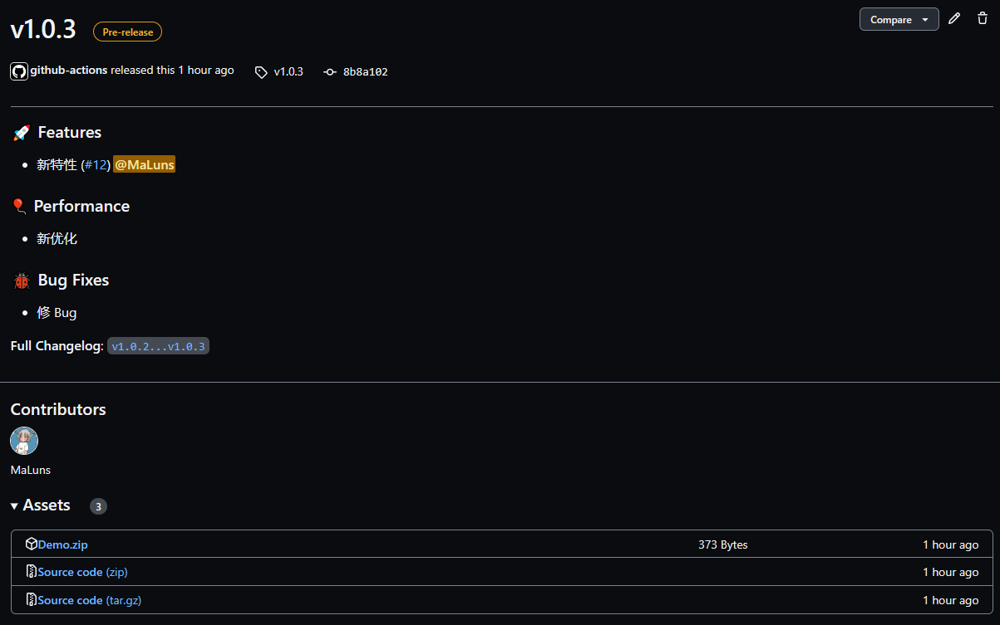

<h1 align="center">Add-RELEASE</h1>

<p align="center">自动创建 Github Release 的 GitHub Action 。</p>

---

<p align="center">
    
</p>


## 参数

| 名称                                      |   类型   | 描述                                                                                                                                                                                                                                                                                                                                                                                                                                     |
| ----------------------------------------- | ------- | ---------------------- |
| `name`                                    | String  | 版本名称。默认为标签名 |
| `tag_name`                                | String  | 标签名。默认为 `github.ref ` |
| `body`                                    | String  | 发布版本说明 |
| `body_path`                               | String  | 指定发布版本说明文件 |
| `draft`                                   | Boolean | 是否是草稿版 |
| `prerelease`                              | Boolean | 是否是预览版 |
| `files`                                   | String  | 以换行符分隔的资源路径，使用 glob 匹配后上传发布 |
| `repository`                              | String  | `<owner>/<repo>` 格式的目标存储库名称。默认为 env.GITHUB_REPOSITORY 变量 |
| `target_commitish`                        | String  | 决定使用哪个提交节点 ，可以是任何分支或提交 SHA ，默认为存储库默认分支 |
| `token`                                   | String  | GitHub 个人访问令牌。默认为 `${{ github.token }}` |
| `generate_release_notes`                  | Boolean | 是否自动生成此版本的名称和主体。如果指定了name，则使用指定的名称;否则，将自动生成一个名称。如果指定了body，则正文将预先挂载到自动生成的注释中。有关更多信息，请参阅 [GitHub docs for this feature](https://docs.github.com/en/repositories/releasing-projects-on-github/automatically-generated-release-notes) |
| `generate_release_notes_by_commit`        | Boolean | 是否根据提交记录生成发版说明 |
| `generate_release_notes_by_commit_rules`  | String  | 匹配提交记录规则 |


💡 当同时提供 `body` 和 `body_path` 时，`body_path` 将是首先尝试，如果路径不能读取然后退回到 `body` 。仅当前两者都没有时 `generate_release_notes_by_commit` 才生效。


`generate_release_notes_by_commit_rules` 默认值：

``` json
[
    {
        "title": "🚀 Features",
        "rule": "feat:"
    },
    {
        "title": "🎈 Performance",
        "rule": "perf:"
    },
    {
        "title": "🐞 Bug Fixes",
        "rule": "fix:"
    }
]
```

## 输出

| 名称              |   类型   | 描述                                                                                                                                                                                                                                                                                                                                                                                                                                     |
| ----------------- | ------- | ---------------------- |
| `url`             | String  | 发布的 Github URL |
| `id`              | String  | 版本标识 |
| `upload_url`      | String  | 上传的资源 URL |

## 示例

``` yaml
name: Add Release

on:
  push:
    tags:
      - "v*"

jobs:
  update_release:
    permissions:
      # 分配写入权限
      contents: write
    runs-on: ubuntu-latest

    steps:
      - uses: actions/checkout@v2

      - name: Zip
        run: |
          zip -r Demo ./src
          
      - name: Release
        uses: MaLuns/add-release@指定版本
        with:
          files: Demo.zip
          generate_by_commit: true
```